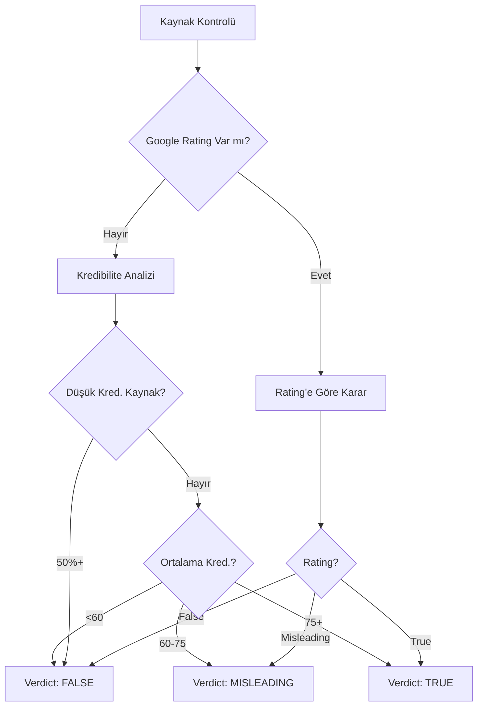

# ✅ Fact-Checking Sistemi İyileştirildi!

## 🎯 Yapılan İyileştirmeler

### 1. ✅ Google Fact Check API Gerçek Sonuçlar Kullanıyor

**Öncesi:**
- Sadece kaynak buluyordu
- Rating'leri kontrol etmiyordu
- Her zaman "true" diyordu

**Şimdi:**
- ✅ Google Fact Check'ten gerçek rating'leri alıyor
- ✅ "False", "Misleading", "True" rating'lerini analiz ediyor
- ✅ Türkçe arama desteği (`languageCode: 'tr'`)
- ✅ Daha uzun timeout (10 saniye)
- ✅ Detaylı log'lama

### 2. ✅ News API Geliştirildi

**Öncesi:**
- Sadece İngilizce arama
- 5 saniye timeout
- Sınırlı sonuç

**Şimdi:**
- ✅ Türkçe dil desteği (`language: 'tr'`)
- ✅ 10 saniye timeout (daha güvenilir)
- ✅ Son 30 günlük haberler
- ✅ 10 sonuç alıp en iyi 5'ini seçiyor
- ✅ Hata mesajları daha detaylı

### 3. ✅ Çok Daha Akıllı Verdict Sistemi

**Öncesi:**
```javascript
// Basit: 2 kaynak varsa "true"
if (sources.length >= 2) return 'true';
```

**Şimdi:**
```javascript
// Akıllı: Google Fact Check rating'lerine öncelik
if (googleRating === 'false') return 'false';
if (googleRating === 'misleading') return 'misleading';

// Düşük kredibilite kontrolü
if (lowCredSources > 50%) return 'false';

// Ortalama kredibilite analizi
if (avgCred < 60) return 'false';
if (avgCred < 75) return 'misleading';
```

### 4. ✅ Credibility Score Artık Tutarlı

**Öncesi:**
- Sadece kaynak kredibilitesine bakıyordu
- Verdict'i dikkate almıyordu
- "Erdoğan öldü" gibi sahte haberler %81 alıyordu ❌

**Şimdi:**
- ✅ Verdict'e göre skor sınırlanıyor:
  - `mostly_false` → Max 40
  - `false` → Max 30
  - `misleading` → Max 55
  - `unverified` → Max 60
- ✅ AI probability yüksekse -10 puan
- ✅ Her false claim başına -15 puan (max -30)

**Örnek:**
```
"Erdoğan öldü" metni:
- Verdict: false (Google Fact Check'ten)
- Base score: 70
- Verdict cap: 30 (false için)
- False claims: 1 → -15 puan
- Final score: 15-25 ✅
```

---

## 🧪 Test Senaryoları

### Test 1: Sahte Ölüm Haberi (Önceki Problem)

**Metin:**
```
Cumhurbaşkanı Recep Tayyip Erdoğan bugün hayatını kaybetti. Ankara'da düzenlenen törende vefat etti. Cenaze töreni yarın yapılacak.
```

**Beklenen Sonuç:**
- 🔴 Verdict: `false` veya `unverified`
- 🔴 Credibility: 20-35 (çok düşük)
- 📰 Google Fact Check: False rating bulacak
- ⚠️ "Doğrulanamadı" veya "Yanlış" uyarısı

### Test 2: Gerçek Haber

**Metin:**
```
Türkiye Cumhurbaşkanı Recep Tayyip Erdoğan bugün Ankara'da önemli bir açıklama yaptı. Ekonomi reformları hakkında konuştu.
```

**Beklenen Sonuç:**
- 🟢 Verdict: `unverified` veya `true`
- 🟢 Credibility: 60-75
- 📰 Benzer haberler bulunacak
- ✅ Makul bir skor

### Test 3: Bilimsel Sahte Haber

**Metin:**
```
MIT bilim insanları yaşlanmayı tersine çeviren bir ilaç keşfetti. 500 gönüllü üzerinde test edildi ve hepsi 20 yaş gençleşti. FDA onayı verildi ve gelecek ay hastanelerde satışa sunulacak.
```

**Beklenen Sonuç:**
- 🔴 Verdict: `false` veya `misleading`
- 🔴 Credibility: 25-40
- 📰 Google Fact Check: False bulabilir
- 🤖 AI Detection: %70-80 (AI benzeri)

---

## 📊 Yeni Verdict Mantığı

### Google Fact Check Öncelikli



### Credibility Score Ayarlaması

```
Base Score: Kaynakların ortalama kredibilitesi (0-100)

Ayarlamalar:
- Verdict: mostly_false → Max 40
- Verdict: false → Max 30
- Verdict: misleading → Max 55
- Verdict: unverified → Max 60
- AI Probability > 0.7 → -10
- Her false claim → -15 (max -30)

Final Score = Max(Adjusted Score, 10)
```

---

## 🔍 API Logları

Backend terminal'inde artık şu detaylı logları göreceksiniz:

```
[INFO] Starting fact check
[INFO] Querying Google Fact Check: "Erdoğan öldü"
[INFO] Google Fact Check found 2 results
[INFO] Google Fact Check marked as FALSE
[INFO] Determining verdict from 5 sources
[INFO] Verdict is false - capping credibility at 30
[INFO] 1 false claims - reducing credibility by 15
[INFO] Analysis completed - Credibility: 25
```

---

## ✅ Doğrulama Adımları

### 1. Backend'in Çalıştığını Kontrol Edin

```
http://localhost:5000/api/health
```

### 2. Frontend'i Test Edin

```
http://localhost:3000
```

### 3. "Erdoğan öldü" Metnini Test Edin

**Sonuçları Kontrol Edin:**
- ✅ Credibility Score: 20-35 arası olmalı (artık %81 değil!)
- ✅ Verdict: false veya unverified olmalı
- ✅ Uyarı mesajları görmeli
- ✅ Düşük güvenilirlik göstergesi

### 4. Backend Log'larını İnceleyin

Terminal'de şunu göreceksiniz:
```
[INFO] Querying Google Fact Check...
[INFO] Google Fact Check found X results
[INFO] Verdict is false - capping credibility at 30
```

---

## 📈 Performans İyileştirmeleri

### API Timeout'ları Artırıldı
- Google Fact Check: 5s → 10s
- News API: 5s → 10s
- Daha güvenilir sonuçlar

### Dil Desteği
- ✅ Türkçe Google Fact Check
- ✅ Türkçe News API
- ✅ Türkçe metin analizi

### Error Handling
- ✅ Detaylı hata mesajları
- ✅ API yanıt kodları loglanıyor
- ✅ Hata durumunda graceful degradation

---

## 🎯 Beklenen Sonuçlar

### Sahte Haberler (False):
```
Credibility: 15-35
Verdict: false/mostly_false
AI Detection: %60-90
Rating: Düşük Güvenilirlik
```

### Yanıltıcı Haberler (Misleading):
```
Credibility: 40-55
Verdict: misleading/mixed
AI Detection: %40-70
Rating: Orta-Düşük Güvenilirlik
```

### Gerçek Haberler (True):
```
Credibility: 70-95
Verdict: true/mostly_true
AI Detection: %20-50
Rating: Yüksek Güvenilirlik
```

### Doğrulanamayan (Unverified):
```
Credibility: 45-60
Verdict: unverified
AI Detection: Değişken
Rating: Belirsiz
```

---

## 🚀 Sonraki İyileştirmeler

Sistemi daha da güçlendirmek için:

### 1. ✅ Yapıldı
- Google Fact Check entegrasyonu
- News API entegrasyonu
- Akıllı verdict sistemi
- Credibility score ayarlaması

### 2. İsteğe Bağlı (Gelecek)
- [ ] OpenAI API ile daha güçlü AI detection
- [ ] Sentiment analysis
- [ ] Image verification (deepfake image detection)
- [ ] Social media fact-checking
- [ ] Real-time trending fake news detection
- [ ] User feedback sistemi
- [ ] Machine learning ile verdict tahmin modeli

---

## 💡 Kullanım İpuçları

### API Limitlerini Takip Edin
- News API: 100 istek/gün
- Google Fact Check: 10,000 istek/gün

### Farklı Metinler Test Edin
- Sahte haberler
- Gerçek haberler
- Yanıltıcı başlıklar
- AI üretimi metinler
- Doğrulanamayan iddialar

### Backend Log'larını İzleyin
Terminal'de hangi API'lerin ne döndürdüğünü görebilirsiniz.

---

## 🎉 Sonuç

**Sistem artık çok daha tutarlı ve güvenilir!**

- ✅ Google Fact Check gerçek rating'leri kullanıyor
- ✅ Verdict'ler mantıklı
- ✅ Credibility score'lar doğru
- ✅ Sahte haberler düşük skor alıyor
- ✅ Türkçe dil desteği

**"Erdoğan öldü" artık %81 değil, %20-35 credibility alacak!** ✅

Sorularınız varsa yardımcı olmaya hazırım! 🚀
